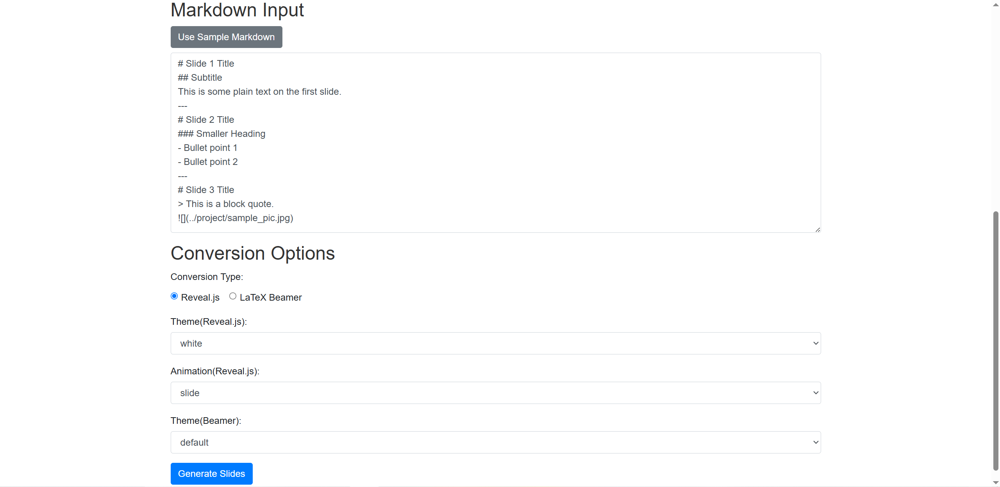
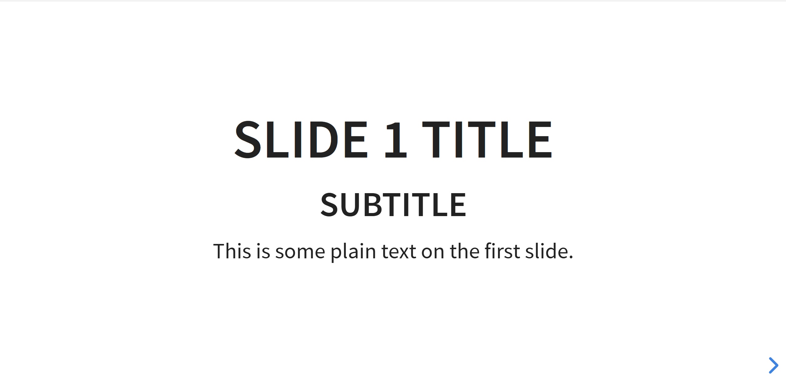
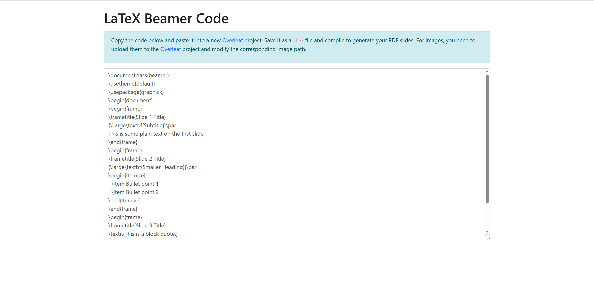
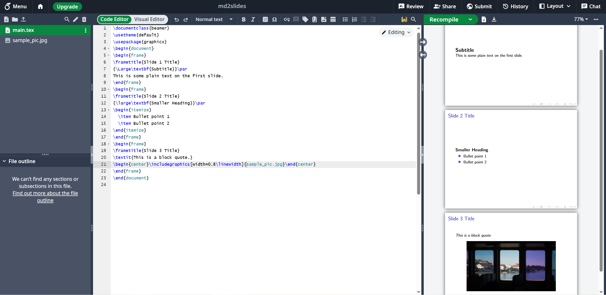
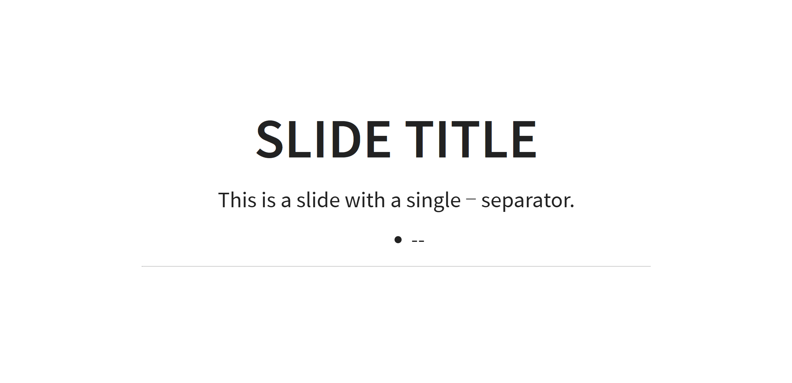
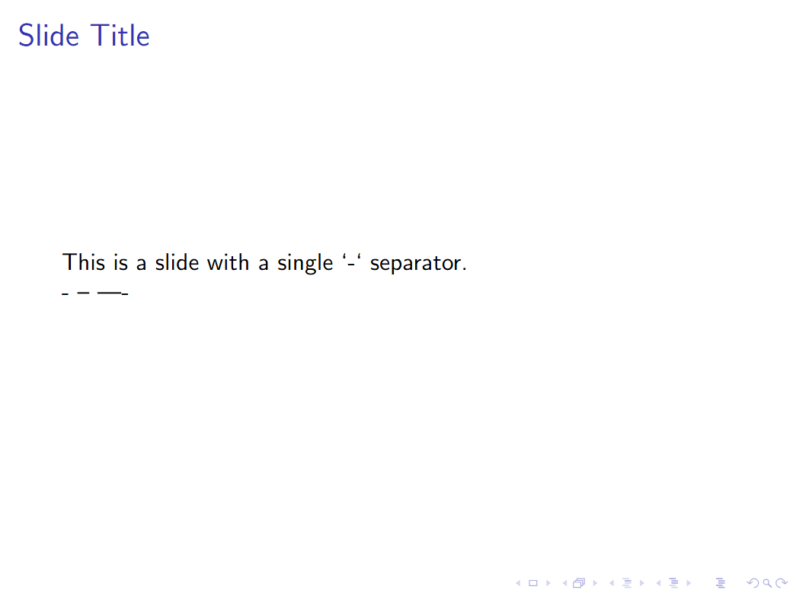
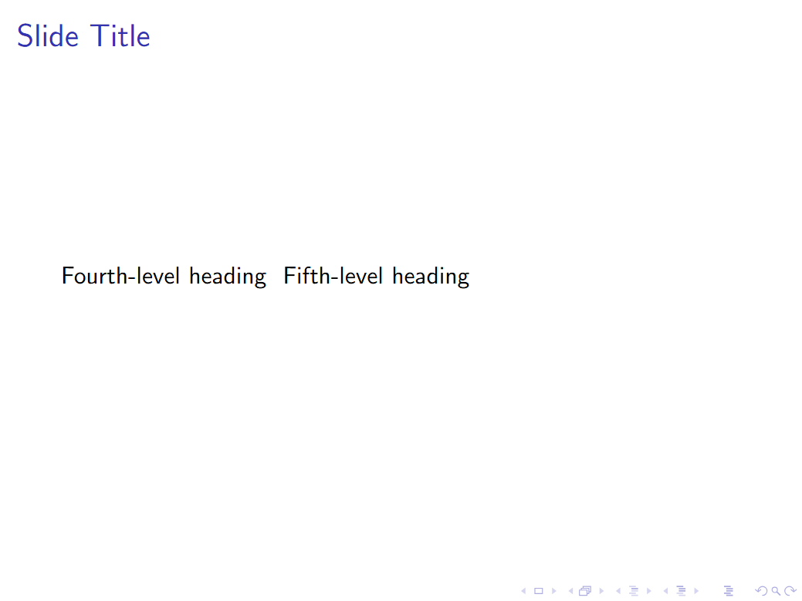
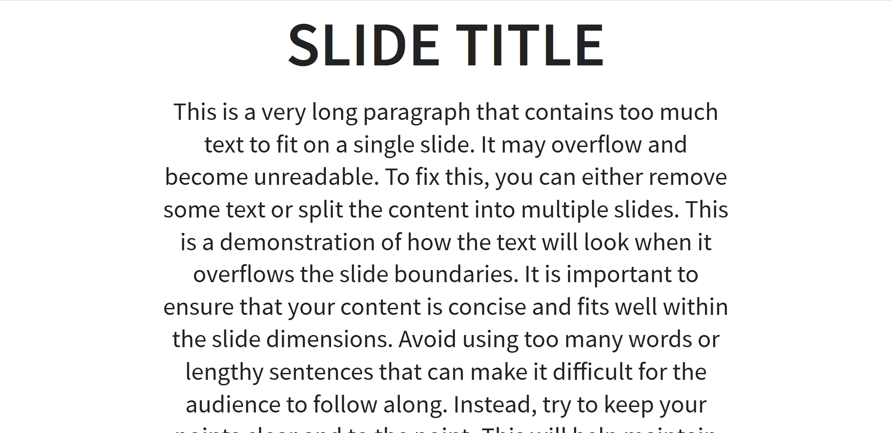
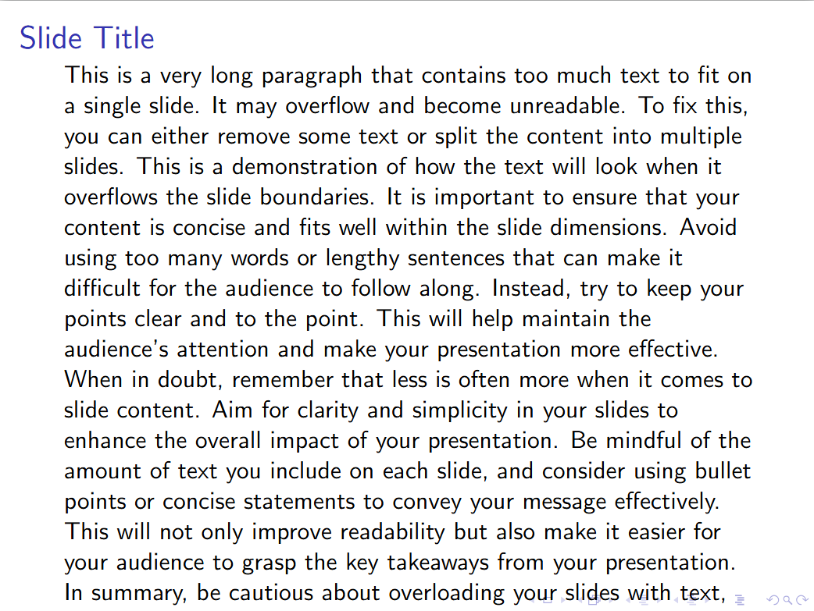

# md2slides

`md2slides` converts Markdown into Reveal.js slides or LaTeX Beamer source through a clean browser-based workspace.

Live app: [https://md2slides-rouge.vercel.app](https://md2slides-rouge.vercel.app)

GitHub repository: [https://github.com/Jrx2003/md2slides](https://github.com/Jrx2003/md2slides)

The original CGI/AWK implementation is still kept in `cgi-bin/convert.awk` for course/reference purposes, while the public app now runs on Vercel with a static frontend and an optional Serverless AI endpoint.

## Table of Contents
1. [Project Overview](#project-overview)
2. [To Get Started](#to-get-started)
3. [Example I/O and Edge Cases](#example-io-and-edge-cases)
   - [Typical Markdown Input and Output](#1-typical-markdown-input-and-output)
   - [Edge Cases](#2-edge-cases)
4. [Folder Structure](#folder-structure)
5. [Important File Descriptions](#important-file-descriptions)
6. [Usage Instructions](#usage-instructions)
7. [Future Improvements](#future-improvements)

---

## Project Overview

This project is a convenient tool for turning Markdown into presentation assets without hand-formatting PowerPoint decks. It is useful when you need a quick working slide draft, want a clean Reveal.js deck, or need Beamer source that can be pasted into Overleaf.

The current interface is a three-panel workspace:

- **Source**: edit Markdown and see slide/word counts.
- **Output**: switch between Reveal.js and Beamer, select themes, and configure transitions.
- **Preview**: view the generated deck, copy the output, download it, or open it in a new tab.

For users who start from rough notes instead of Markdown, the app includes an optional AI draft feature. The AI endpoint runs on Vercel Serverless Functions, uses an access code, and reads provider credentials from environment variables instead of exposing API keys in the browser.

---

## To Get Started

### Run locally

Static preview:

```bash
npm run serve
```

Then open `http://localhost:5173`.

Vercel-compatible local dev, including the optional AI endpoint:

```bash
npm run dev
```

Set `KIMI_API_KEY` before using the AI draft endpoint. `DASHSCOPE_API_KEY` or `QWEN_API_KEY` are still supported as fallbacks.
Set `MD2SLIDES_ACCESS_CODE` to restrict AI generation to users with the access code.
Without the environment variable, the browser falls back to a local outline generator.

### Deploy to Vercel

1. Import this repository into Vercel or deploy from the Vercel CLI.
2. Keep the default build settings; this project does not need a build step.
3. Add `KIMI_API_KEY`, optional `KIMI_BASE_URL` / `KIMI_MODEL`, and `MD2SLIDES_ACCESS_CODE` in Vercel Environment Variables if AI draft generation is needed.
4. Deploy. `vercel.json` rewrites `/` to `project/index.html` and keeps `/api/generate-markdown` as a Serverless Function.

### Use the app

To quickly test the core workflow:

1. Open the live app or run it locally.
2. Edit the Markdown in the **Source** panel or click **Sample**.
3. Select **Reveal.js** or **Beamer** in the **Output** panel.
4. Adjust the Reveal theme/transition or Beamer theme.
5. Use **Copy**, **Download**, or **Open** from the **Preview** panel.

To try the AI draft feature:

1. Paste rough notes into **AI draft**, or click **Sample notes**.
2. Enter the access code provided by the maintainer.
3. Click **Generate**. If the access code or provider configuration is missing, the app falls back to a local outline generator.
4. Review the generated Markdown in the **Source** panel before exporting.

**When entering your own markdown input, please follow the placeholder instructions to ensure correct formatting:**

1. **Slide Separator**:  
   Use `---` to separate slides. Each `---` starts a new slide.

2. **Headings**:  
   - `# ` for the slide title (converted to `\frametitle` in LaTeX).  
   - `## ` for large headings within a slide.  
   - `### ` for smaller headings within a slide.

3. **Lists**:  
   Use `- ` to create unordered list items (converted to `\item` in LaTeX).

4. **Block Quotes**:  
   Use `> ` to create block quotes (converted to italicized text in LaTeX).

5. **Images**:  
   Use the syntax `` to embed images (converted to `\includegraphics` in LaTeX with 80% slide width).

6. **Bold Text**:  
   Use `**bold text**` to make text bold (converted to `\textbf` in LaTeX).

7. **Plain Text**:  
   Any plain text will be displayed as-is on the slide.

There is no strict formatting requirement for AI draft notes. The generated Markdown may vary, so review it before using the output in a client-facing deck.

---

## Example I/O and Edge Cases

For a clear demonstration of the project, please refer to the [YouTube Demo](https://youtu.be/hn3GUFsApkQ). Below are examples of typical Markdown inputs and their corresponding outputs in both **Reveal.js** and **Beamer** formats, followed by explanations of some edge cases that are not explicitly mentioned in the video.

### **1. Typical Markdown Input and Output**

**Input:**


**Reveal.js Output:**


**Beamer Output:**



---

### **2. Edge Cases**

#### **Case 1: Different Numbers of `-`**

**Input:**
```markdown
# Slide Title
This is a slide with a single `-` separator.

-
--
----
```

In **Reveal.js**, the number of dashes used in the input will determine how they are rendered.

- If a single `-` is used instead of `---`, it will be treated as a list item.  
- `--` will be displayed as-is.  
- `----` or more will render as a long horizontal line.

**Reveal.js Output:**


**Beamer Output:**


#### **Case 2: Using `####` and `#####` Headings**

In **Reveal.js**, these headings will render with very small text, making them less noticeable.  
In **Beamer**, these headings are not supported and will not render.  

**Input:**
```markdown
# Slide Title
#### Fourth-level heading
##### Fifth-level heading
```

**Reveal.js Output:**


**Beamer Output:**


#### **Case 3: Too Much Text on a Single Slide**

If too much text is added to a single slide, it may overflow and become unreadable.  
To fix this, consider:
1. Removing some text or headings.
2. Splitting the content into multiple slides.

**Input:**
```markdown
# Slide Title
This is a very long paragraph that contains too much text to fit on a single slide. It may overflow and become unreadable. To fix this, you can either remove some text or split the content into multiple slides. This is a demonstration of how the text will look when it overflows the slide boundaries. It is important to ensure that your content is concise and fits well within the slide dimensions. Avoid using too many words or lengthy sentences that can make it difficult for the audience to follow along. Instead, try to keep your points clear and to the point. This will help maintain the audience's attention and make your presentation more effective. When in doubt, remember that less is often more when it comes to slide content. Aim for clarity and simplicity in your slides to enhance the overall impact of your presentation. Be mindful of the amount of text you include on each slide, and consider using bullet points or concise statements to convey your message effectively. This will not only improve readability but also make it easier for your audience to grasp the key takeaways from your presentation. In summary, be cautious about overloading your slides with text, and always prioritize clarity and simplicity in your content. Thank you for your attention. Remember to keep your slides visually appealing and easy to read. This will greatly enhance the overall quality of your presentation and leave a lasting impression on your audience.
```

**Reveal.js Output:**


**Beamer Output:**


#### **Case 4: Oversized Images**
If an inserted image is too large, it may not fit properly on the slide.  
In **Reveal.js**, this issue is particularly challenging to resolve dynamically.  
- **Recommendation:** Resize the browser window or zoom out to adjust the display.  
- **Note:** Allowing users to input image dimensions would compromise the simplicity of the tool.

**Input:**
```markdown
# Slide with Large Image
)
```

**Reveal.js Output:**


#### Summary of Edge Cases
1. **Single `-` Separator**: Treated as a list or horizontal line depending on the number of dashes.  
2. **Small Headings (`####` and `#####`)**: Not recommended for slides due to poor visibility or lack of support.  
3. **Text Overflow**: Split content into multiple slides or reduce text.  
4. **Oversized Images**: Adjust browser zoom or resize the image externally.  

These limitations are intentional to maintain the simplicity and ease of use of the tool.

---

## Folder Structure

```
md2slides
├── README.md
├── api
│   ├── generate-markdown.js # Optional AI draft Serverless Function
├── cgi-bin
│   ├── convert.awk          # Original CGI/AWK converter retained for reference
├── package.json
├── project
│   ├── index.html           # Web app shell
│   ├── sample_md.md         # Sample Markdown file for testing
│   ├── sample_pic.jpg       # Sample image used in the project
│   ├── sample_text.txt      # Sample notes for AI draft testing
│   ├── script.js            # Client-side conversion and preview logic
│   ├── style.css            # Responsive workspace styling
├── vercel.json
```

## Important File Descriptions

### 1. `project/index.html`

- The main HTML file for the web interface.
- Defines the Source, Output, AI draft, and Preview panels.

### 2. `project/script.js`

- Runs the client-side Markdown conversion workflow.
- Builds Reveal.js HTML directly in the browser.
- Builds LaTeX Beamer source directly in the browser.
- Handles sample content, live preview, copy, download, open-in-new-tab, and AI draft calls.

### 3. `project/style.css`

- Defines the responsive three-panel application layout.
- Keeps the tool usable on both desktop and mobile screens.

### 4. `api/generate-markdown.js`

- Optional Vercel Serverless Function for AI-assisted Markdown generation.
- Requires `MD2SLIDES_ACCESS_CODE` and an access code sent by the user.
- Uses Kimi credentials from environment variables, with Qwen/DashScope fallback support.

### 5. `cgi-bin/convert.awk`

- Original CGI/AWK script retained for reference.
- Parses HTTP parameters and converts Markdown to Reveal.js HTML or LaTeX Beamer source.

### 6. `project/sample_md.md`

- A sample Markdown file provided for testing the conversion functionality.
- Can be used as an example to understand the expected input format.

### 7. `project/sample_pic.jpg`

- A sample image file included in the project.
- May be used for testing image embedding in slides or as part of the web interface.

### 8. `project/sample_text.txt`

- A sample plain text file for reference or testing purposes.

---

## Usage Instructions

1. Open [https://md2slides-rouge.vercel.app](https://md2slides-rouge.vercel.app).
2. Write Markdown in the Source panel. Use `---` on its own line to split slides.
3. Choose Reveal.js or Beamer output.
4. For Reveal.js, use the live iframe preview and open/download the generated HTML.
5. For Beamer, copy or download the generated `.tex` source and compile it in a LaTeX environment such as Overleaf.
6. Use AI draft only if you have the maintainer-provided access code.

---

## Future Improvements

- Support for more themes.
- Support for various sizes of images.
