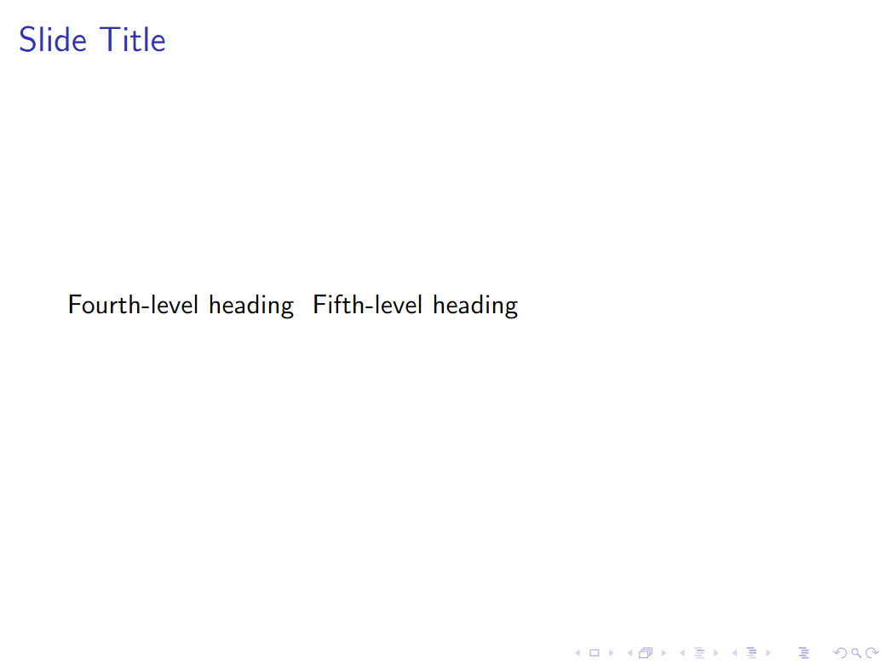

# Documentation for `md2slides` Project

The `md2slides` project is a tool designed to convert Markdown content into HTML/PDF slides using Reveal.js/LaTex Beamer. 

Web interface: [md2slides](http://eecslab-22.case.edu/~jxx583/project/) **(CWRU VPN REQUIRED!)**

Demo Video: [CSDS285 Project Demo, Jerry Xu](https://youtu.be/hn3GUFsApkQ)

GitHub Repository: [md2slides](https://github.com/Jrx2003/md2slides)

**You can also read this README file in the GitHub repository for better formatting.**

## Project Overview

This project, markdown to slides, is a convenient tool that lets you generate slides using simple markdown. If you ever receive an urgent task that requires you to prepare a presentation in five minutes, you should give this a try. If you're tired of having GPT generate slide content and then painstakingly copying and formatting it in PowerPoint, you should try this. And if you want clean, themed slides without having to learn the complex syntax of reveal.js or LaTeX Beamer, then this is definitely for you.

The goal of this project is to create a script that can quickly generate slides from Markdown files, with convenient keyboard shortcuts to select themes and animations. The core of this functionality lies in the `convert.awk` file within the project, which process and adjust Markdown text to make it compatible with both **Reveal.js** and **LaTeX Beamer** formats. Users can input Markdown text, choose formats, select themes and animations through `index.html`. This information is sent to `convert.awk` via the POST method, making it more intuitive and straightforward to personalize their slides. This part of the project also best reflects the skills I’ve gained in the **CSDS285** course regarding scripting languages.

The `script.js` file in the project implements several additional features, such as inserting sample input with a button click. For users who are not familiar with Markdown, I referred to the documentation of LLM **Qwen-Plus** and integrated its API to help generate compliant Markdown documents for testing. This makes the project much more beginner-friendly, even though this part is not a requirement for CSDS285 nor the main focus of the project.

---

## 🛠️ To Get Started

To quickly test the basic functionality:

1. Click **"Use Sample Markdown"**
2. Select your preferred **theme** and **animation**
3. Click **"Generate Slides"**

To try out the **AI assistant feature**:

1. Click **"Use Sample Text"**
2. Click **"Generate Markdown"**
3. Finally, click **"Generate Slides"**

**When entering your own markdown input, please follow the placeholder instructions to ensure correct formatting:**

1. **Slide Separator**:  
   Use `---` to separate slides. Each `---` starts a new slide.

2. **Headings**:  
   - `# ` for the slide title (converted to `\frametitle` in LaTeX).  
   - `## ` for large headings within a slide.  
   - `### ` for smaller headings within a slide.

3. **Lists**:  
   Use `- ` to create unordered list items (converted to `\item` in LaTeX).

4. **Block Quotes**:  
   Use `> ` to create block quotes (converted to italicized text in LaTeX).

5. **Images**:  
   Use the syntax `` to embed images (converted to `\includegraphics` in LaTeX with 80% slide width).

6. **Bold Text**:  
   Use `**bold text**` to make text bold (converted to `\textbf` in LaTeX).

7. **Plain Text**:  
   Any plain text will be displayed as-is on the slide.

There is no formatting requirement for the AI assistant text input. You can enter any text, and it will be converted to Markdown format automatically. The generated Markdown may be different each time, but it will always be compliant with the requirements of the `convert.awk` file.

---

## Example I/O and Edge Cases

For a clear demonstration of the project, please refer to the [YouTube Demo](https://youtu.be/hn3GUFsApkQ). Below are examples of typical Markdown inputs and their corresponding outputs in both **Reveal.js** and **Beamer** formats, followed by explanations of some edge cases that are not explicitly mentioned in the video.

### **1. Typical Markdown Input and Output**

**Input:**


**Reveal.js Output:**


**Beamer Output:**


---

### **2. Edge Cases**

#### **Case 1: Different Numbers of `-`**

**Input:**
```markdown
# Slide Title
This is a slide with a single `-` separator.

-
--
----
```

In **Reveal.js**, the number of dashes used in the input will determine how they are rendered.

- If a single `-` is used instead of `---`, it will be treated as a list item.  
- `--` will be displayed as-is.  
- `----` or more will render as a long horizontal line.

**Reveal.js Output:**


**Beamer Output:**


#### **Case 2: Using `####` and `#####` Headings**

In **Reveal.js**, these headings will render with very small text, making them less noticeable.  
In **Beamer**, these headings are not supported and will not render.  

**Input:**
```markdown
# Slide Title
#### Fourth-level heading
##### Fifth-level heading
```

**Reveal.js Output:**


**Beamer Output:**


#### **Case 3: Too Much Text on a Single Slide**

If too much text is added to a single slide, it may overflow and become unreadable.  
To fix this, consider:
1. Removing some text or headings.
2. Splitting the content into multiple slides.

**Input:**
```markdown
# Slide Title
This is a very long paragraph that contains too much text to fit on a single slide. It may overflow and become unreadable. To fix this, you can either remove some text or split the content into multiple slides. This is a demonstration of how the text will look when it overflows the slide boundaries. It is important to ensure that your content is concise and fits well within the slide dimensions. Avoid using too many words or lengthy sentences that can make it difficult for the audience to follow along. Instead, try to keep your points clear and to the point. This will help maintain the audience's attention and make your presentation more effective. When in doubt, remember that less is often more when it comes to slide content. Aim for clarity and simplicity in your slides to enhance the overall impact of your presentation. Be mindful of the amount of text you include on each slide, and consider using bullet points or concise statements to convey your message effectively. This will not only improve readability but also make it easier for your audience to grasp the key takeaways from your presentation. In summary, be cautious about overloading your slides with text, and always prioritize clarity and simplicity in your content. Thank you for your attention. Remember to keep your slides visually appealing and easy to read. This will greatly enhance the overall quality of your presentation and leave a lasting impression on your audience.
```

**Reveal.js Output:**


**Beamer Output:**


#### **Case 4: Oversized Images**
If an inserted image is too large, it may not fit properly on the slide.  
In **Reveal.js**, this issue is particularly challenging to resolve dynamically.  
- **Recommendation:** Resize the browser window or zoom out to adjust the display.  
- **Note:** Allowing users to input image dimensions would compromise the simplicity of the tool.

**Input:**
```markdown
# Slide with Large Image
)
```

**Reveal.js Output:**


#### Summary of Edge Cases
1. **Single `-` Separator**: Treated as a list or horizontal line depending on the number of dashes.  
2. **Small Headings (`####` and `#####`)**: Not recommended for slides due to poor visibility or lack of support.  
3. **Text Overflow**: Split content into multiple slides or reduce text.  
4. **Oversized Images**: Adjust browser zoom or resize the image externally.  

These limitations are intentional to maintain the simplicity and ease of use of the tool.

---

## Folder Structure

```
md2slides
├── README.md          # Project documentation (this file)
├── cgi-bin
│   ├── convert.awk    # Core script for Markdown to HTML slide conversion
├── project
│   ├── index.html     # Main entry point for the web interface
│   ├── sample_md.md   # Sample Markdown file for testing
│   ├── sample_pic.jpg # Sample image used in the project
│   ├── sample_text.txt# Sample text file for reference
│   ├── script.js      # JavaScript file for additional functionality
│   ├── style.css      # CSS file for custom styling
```

## Important File Descriptions

### 1. `cgi-bin/convert.awk`

- A core script written in `awk` that processes HTTP requests.
- Converts user-submitted Markdown content into HTML slides (Reveal.js) or .tex file (Beamer).
- Features:
  - Parses HTTP parameters and decodes URL-encoded data.
  - Supports themes and animations for slides.
  - Outputs HTML with embedded Markdown for Reveal.js to render.

### 2. `project/index.html`

- The main HTML file for the web interface.
- Likely serves as the front-end for users to upload Markdown files or input content directly.

### 3. `project/script.js`

- Includes functions to insert sample Markdown or text into the input area.
- Implements the AI assistant feature to generate compliant Markdown documents.

### 4. `project/sample_md.md` (4-6 can be changed based on your preference)

- A sample Markdown file provided for testing the conversion functionality.
- Can be used as an example to understand the expected input format.

### 5. `project/sample_pic.jpg`

- A sample image file included in the project.
- May be used for testing image embedding in slides or as part of the web interface.

### 6. `project/sample_text.txt`

- A sample plain text file for reference or testing purposes.

---

## Usage Instructions

1. Deploy the `cgi-bin/convert.awk` script on a CGI-enabled server (e.g., Apache or Nginx).
2. Use the `index.html` file as the front-end for submitting Markdown content.
3. Test the functionality using the provided sample files (`sample_md.md`, `sample_pic.jpg`, etc.).
4. The server will process the Markdown input and return HTML slides styled with Reveal.js.

---

## Future Improvements

- Support for more themes.
- Support for various sizes of images.